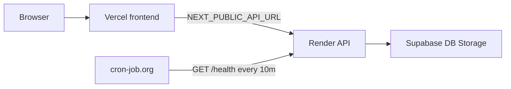

# NACOS Platform — Manual Setup Guide

Everything in this file must be done by hand. AI cannot do these steps.
Complete them in order before running any code.

For local elections testing after deploy, see [DEV_TESTING.md](./DEV_TESTING.md).

---

## Deployment overview (production)

This repo is a **monorepo**. You deploy **two apps** from one GitHub repo:

| App | Host | Root directory | Public URL |
|-----|------|----------------|------------|
| **Frontend** (Next.js) | [Vercel](https://vercel.com) | `frontend` | `https://your-app.vercel.app` |
| **Backend** (Express API) | [Render](https://render.com) | `backend` | `https://your-api.onrender.com` |
| **Database + storage** | [Supabase](https://supabase.com) | — | (no public site) |

**Recommended order**

1. **Supabase** — project, SQL (Step 2), buckets (Step 3), super admin (§2.19)
2. **Secrets** — JWT keys (Step 4), `REFRESH_TOKEN_SECRET` + `CRON_SECRET` (Step 7)
3. **Resend** — API key (Step 5)
4. **Render** — backend Web Service with `backend` root (Step 6)
5. **Vercel** — frontend with `frontend` root + `NEXT_PUBLIC_API_URL` = Render URL (Step 7)
6. **Render env** — set `FRONTEND_URL` to your live Vercel URL (Step 7)
7. **cron-job.org** — ping Render `/health` every 10 minutes (Step 8) so free tier does not sleep
8. **RLS** — Step 10 (after first deploy is optional but recommended)



---

## Step 1 — Supabase Project

### 1.1 Create the project

1. Go to https://supabase.com → sign in / create account
2. **New project**
   - **Name:** `nacos-platform` (or your chapter name)
   - **Database password:** strong password → save in a password manager (you need it for direct DB access only; the API uses the service role key)
   - **Region:** **West EU (Ireland)** or closest to your users (good latency from Nigeria)
3. Wait until status is **Active** (~2 minutes)

### 1.2 Copy API credentials

1. **Project Settings** (gear) → **API**
2. Copy and store securely:

| Dashboard field | Your env var | Used by |
|-----------------|--------------|---------|
| **Project URL** | `SUPABASE_URL` | Render backend only |
| **service_role** `secret` | `SUPABASE_SERVICE_ROLE_KEY` | Render backend only |

**Never** put the service role key in Vercel, the browser, or git. The frontend talks only to Render.

### 1.3 SQL Editor (for Step 2)

1. Left sidebar → **SQL Editor** → **New query**
2. Paste each block from Step 2, run with **Run** (or Ctrl+Enter)
3. If a block fails, read the error — often means a previous block was skipped or run twice

### 1.4 Auth settings (important)

This platform uses **custom auth on Render** (PIN + JWT), not Supabase Auth for members.

1. **Authentication** → you do **not** need to enable email signup for students in Supabase Auth
2. Do **not** expose the `anon` key on the frontend for this architecture

---

## Step 2 — Supabase Database Tables

Go to **SQL Editor** and run each block below **from top to bottom**.

**Order note:** Run **§2.1–2.21**, then **§2.22 (Elections)**, then **§2.18 (Indexes)**, then **§2.19 (Super admin seed)**. Sections 2.20–2.22 are placed before 2.18 so tables exist before indexes reference them.

### 2.1 — Enable UUID Extension
```sql
create extension if not exists "uuid-ossp";
```

### 2.2 — Enums
```sql
create type user_role as enum ('super_admin', 'executive', 'member', 'alumni', 'guest');
create type user_level as enum ('100', '200', '300', '400', 'staff');
create type academic_status as enum ('active', 'alumni', 'suspended', 'transferred_out');
create type admission_type as enum ('regular', 'transfer', 'readmission');
create type transaction_type as enum ('credit', 'debit', 'transfer_in', 'transfer_out', 'redemption', 'upload_reward', 'career_submission_bounty');
create type upload_status as enum ('pending', 'approved', 'rejected');
create type order_status as enum ('pending', 'fulfilled', 'cancelled');
create type item_type as enum ('digital', 'physical');
create type event_status as enum ('draft', 'published', 'cancelled');
create type notification_type as enum ('vault_approved', 'vault_rejected', 'credit_received', 'transfer', 'order_update', 'announcement', 'message', 'event_reminder', 'career_verified', 'career_rejected', 'yearbook_published');
create type announcement_target as enum ('public', 'members', 'all');
create type blog_status as enum ('draft', 'published');
create type semester_type as enum ('1', '2');
create type yearbook_edition_status as enum ('draft', 'published', 'archived');
create type employment_type as enum ('full_time', 'part_time', 'adjunct', 'visiting', 'external');
create type teaching_status as enum ('active', 'on_sabbatical', 'on_leave');
create type upload_kind as enum ('past_question', 'course_material');
create type career_posting_status as enum ('draft', 'pending_verification', 'verified', 'rejected', 'expired');
create type election_kind as enum ('executive', 'custom');
create type election_scope as enum ('chapter', 'department');
create type work_mode as enum ('onsite', 'remote', 'hybrid');
```

### 2.3 — Departments
```sql
create table departments (
  id uuid primary key default uuid_generate_v4(),
  name text not null,
  code text not null unique,
  is_active boolean not null default true,
  created_at timestamptz not null default now()
);

insert into departments (name, code) values ('Computer Science', 'CS');
```

### 2.4 — Academic Sessions
```sql
create table academic_sessions (
  id uuid primary key default uuid_generate_v4(),
  name text not null,
  start_date date not null,
  end_date date not null,
  is_current boolean not null default false,
  created_at timestamptz not null default now()
);
```

### 2.5 — Users
```sql
create table users (
  id uuid primary key default uuid_generate_v4(),
  matric_number text not null unique,
  email text not null unique,
  password_hash text not null,
  role user_role not null default 'member',
  first_name text not null,
  last_name text not null,
  display_name text,
  bio text,
  profile_photo_url text,
  department_id uuid references departments(id),
  level user_level,
  level_of_entry user_level,
  year_of_admission integer,
  expected_graduation_year integer,
  actual_graduation_year integer,
  academic_status academic_status not null default 'active',
  admission_type admission_type not null default 'regular',
  linkedin_url text,
  github_url text,
  other_social_links jsonb default '{}',
  email_visible boolean not null default false,
  wallet_balance integer not null default 0,
  is_email_verified boolean not null default false,
  is_active boolean not null default true,
  notification_prefs jsonb default '{"email_on_vault": true, "email_on_credit": true, "email_on_transfer": true, "email_on_order": true}',
  last_login_at timestamptz,
  created_at timestamptz not null default now(),
  updated_at timestamptz not null default now()
);
```

### 2.6 — Onboarding PINs
```sql
create table onboarding_pins (
  id uuid primary key default uuid_generate_v4(),
  pin_hash text not null,
  matric_number text not null,
  department_id uuid references departments(id),
  created_by uuid references users(id),
  expires_at timestamptz not null,
  is_used boolean not null default false,
  used_at timestamptz,
  level_of_entry user_level,
  admission_type admission_type not null default 'regular',
  created_at timestamptz not null default now()
);
```

### 2.7 — Auth Support Tables
```sql
create table email_verifications (
  id uuid primary key default uuid_generate_v4(),
  user_id uuid not null references users(id) on delete cascade,
  token_hash text not null,
  expires_at timestamptz not null,
  used_at timestamptz,
  created_at timestamptz not null default now()
);

create table password_resets (
  id uuid primary key default uuid_generate_v4(),
  user_id uuid not null references users(id) on delete cascade,
  token_hash text not null,
  expires_at timestamptz not null,
  used_at timestamptz,
  created_at timestamptz not null default now()
);

create table refresh_tokens (
  id uuid primary key default uuid_generate_v4(),
  user_id uuid not null references users(id) on delete cascade,
  token_hash text not null,
  family_id uuid not null,
  expires_at timestamptz not null,
  is_revoked boolean not null default false,
  created_at timestamptz not null default now()
);
```

### 2.8 — Executive Assignments
```sql
create table executive_assignments (
  id uuid primary key default uuid_generate_v4(),
  user_id uuid not null references users(id),
  session_id uuid references academic_sessions(id),
  role_title text not null,
  assigned_by uuid not null references users(id),
  is_active boolean not null default true,
  created_at timestamptz not null default now()
);
```

### 2.9 — Vault
```sql
create table vault_courses (
  id uuid primary key default uuid_generate_v4(),
  department_id uuid not null references departments(id),
  level user_level not null,
  semester semester_type not null,
  course_code text not null,
  course_name text not null,
  created_by uuid references users(id),
  created_at timestamptz not null default now(),
  unique(department_id, course_code, level, semester)
);

create table vault_uploads (
  id uuid primary key default uuid_generate_v4(),
  uploader_id uuid not null references users(id),
  course_id uuid not null references vault_courses(id),
  title text not null,
  description text,
  file_url text not null,
  file_size_bytes integer not null,
  file_name text not null,
  status upload_status not null default 'pending',
  reviewed_by uuid references users(id),
  reviewed_at timestamptz,
  rejection_reason text,
  download_count integer not null default 0,
  flag_count integer not null default 0,
  credits_awarded boolean not null default false,
  created_at timestamptz not null default now(),
  updated_at timestamptz not null default now()
);

alter table vault_uploads add column upload_kind upload_kind not null default 'past_question';

create table vault_flags (
  id uuid primary key default uuid_generate_v4(),
  upload_id uuid not null references vault_uploads(id) on delete cascade,
  flagged_by uuid not null references users(id),
  reason text not null,
  resolved boolean not null default false,
  resolved_by uuid references users(id),
  created_at timestamptz not null default now()
);
```

Lecturers and per-session teaching assignments (vault courses):

```sql
create table lecturers (
  id uuid primary key default uuid_generate_v4(),
  name text not null,
  title text,
  photo_url text,
  email text,
  department_id uuid references departments(id),
  employment_type employment_type not null default 'full_time',
  is_active boolean not null default true,
  created_at timestamptz not null default now(),
  updated_at timestamptz not null default now()
);

create table course_teaching_assignments (
  id uuid primary key default uuid_generate_v4(),
  course_id uuid not null references vault_courses(id) on delete cascade,
  lecturer_id uuid not null references lecturers(id),
  session_id uuid references academic_sessions(id),
  semester semester_type not null,
  teaching_status teaching_status not null default 'active',
  created_by uuid references users(id),
  created_at timestamptz not null default now(),
  unique(course_id, lecturer_id, session_id, semester)
);
```

### 2.10 — Wallet
```sql
create table wallet_transactions (
  id uuid primary key default uuid_generate_v4(),
  user_id uuid not null references users(id),
  type transaction_type not null,
  amount integer not null check (amount > 0),
  balance_after integer not null,
  remark text not null check (char_length(remark) >= 3),
  reference_id uuid,
  actor_id uuid references users(id),
  created_at timestamptz not null default now()
);

create table transfers (
  id uuid primary key default uuid_generate_v4(),
  sender_id uuid not null references users(id),
  receiver_id uuid not null references users(id),
  amount integer not null check (amount > 0),
  remark text not null,
  sender_tx_id uuid references wallet_transactions(id),
  receiver_tx_id uuid references wallet_transactions(id),
  created_at timestamptz not null default now()
);
```

### 2.11 — Marketplace
```sql
create table marketplace_items (
  id uuid primary key default uuid_generate_v4(),
  name text not null,
  description text,
  price_in_credits integer not null check (price_in_credits > 0),
  item_type item_type not null,
  stock_count integer,
  image_url text,
  is_available boolean not null default true,
  digital_delivery_content text,
  created_by uuid references users(id),
  created_at timestamptz not null default now(),
  updated_at timestamptz not null default now()
);

create table orders (
  id uuid primary key default uuid_generate_v4(),
  user_id uuid not null references users(id),
  item_id uuid not null references marketplace_items(id),
  quantity integer not null default 1,
  total_credits_spent integer not null,
  status order_status not null default 'pending',
  fulfillment_note text,
  fulfilled_by uuid references users(id),
  fulfilled_at timestamptz,
  transaction_id uuid references wallet_transactions(id),
  created_at timestamptz not null default now()
);
```

### 2.12 — Events
```sql
create table events (
  id uuid primary key default uuid_generate_v4(),
  title text not null,
  description text,
  start_datetime timestamptz not null,
  end_datetime timestamptz,
  location text,
  is_online boolean not null default false,
  meeting_link text,
  banner_image_url text,
  rsvp_limit integer,
  status event_status not null default 'draft',
  created_by uuid references users(id),
  created_at timestamptz not null default now(),
  updated_at timestamptz not null default now()
);

create table event_rsvps (
  id uuid primary key default uuid_generate_v4(),
  event_id uuid not null references events(id) on delete cascade,
  user_id uuid not null references users(id),
  created_at timestamptz not null default now(),
  unique(event_id, user_id)
);
```

### 2.13 — CMS & Content
```sql
create table cms_sections (
  id uuid primary key default uuid_generate_v4(),
  section_key text not null unique,
  content jsonb not null default '{}',
  updated_by uuid references users(id),
  updated_at timestamptz not null default now()
);

create table blog_posts (
  id uuid primary key default uuid_generate_v4(),
  title text not null,
  slug text not null unique,
  excerpt text,
  content jsonb not null default '{}',
  cover_image_url text,
  author_id uuid references users(id),
  status blog_status not null default 'draft',
  published_at timestamptz,
  tags text[] default '{}',
  created_at timestamptz not null default now(),
  updated_at timestamptz not null default now()
);

create table gallery_items (
  id uuid primary key default uuid_generate_v4(),
  title text,
  image_url text not null,
  event_id uuid references events(id) on delete set null,
  tags text[] default '{}',
  uploaded_by uuid references users(id),
  created_at timestamptz not null default now()
);

create table faculty_staff (
  id uuid primary key default uuid_generate_v4(),
  name text not null,
  position text not null,
  role_category text not null default 'staff',
  bio text,
  photo_url text,
  email text,
  department_id uuid references departments(id),
  display_order integer not null default 0,
  is_active boolean not null default true,
  created_at timestamptz not null default now(),
  updated_at timestamptz not null default now()
);

create table announcements (
  id uuid primary key default uuid_generate_v4(),
  title text not null,
  body text not null,
  is_active boolean not null default true,
  target announcement_target not null default 'members',
  expires_at timestamptz,
  created_by uuid references users(id),
  created_at timestamptz not null default now()
);

create table news_items (
  id uuid primary key default uuid_generate_v4(),
  title text not null,
  body text not null,
  image_url text,
  published_at timestamptz not null default now(),
  created_by uuid references users(id),
  created_at timestamptz not null default now(),
  updated_at timestamptz not null default now()
);
```

### 2.14 — Alumni Badges
```sql
create table alumni_badges (
  id uuid primary key default uuid_generate_v4(),
  user_id uuid not null references users(id),
  badge_type text not null,
  label text not null,
  session_id uuid references academic_sessions(id),
  awarded_by uuid references users(id),
  created_at timestamptz not null default now()
);
```

### 2.15 — Messaging
```sql
create table conversations (
  id uuid primary key default uuid_generate_v4(),
  created_at timestamptz not null default now()
);

create table conversation_participants (
  id uuid primary key default uuid_generate_v4(),
  conversation_id uuid not null references conversations(id) on delete cascade,
  user_id uuid not null references users(id),
  joined_at timestamptz not null default now(),
  last_read_at timestamptz,
  unique(conversation_id, user_id)
);

create table messages (
  id uuid primary key default uuid_generate_v4(),
  conversation_id uuid not null references conversations(id) on delete cascade,
  sender_id uuid not null references users(id),
  content text not null,
  is_deleted boolean not null default false,
  created_at timestamptz not null default now()
);
```

### 2.16 — Notifications
```sql
create table notifications (
  id uuid primary key default uuid_generate_v4(),
  user_id uuid not null references users(id) on delete cascade,
  title text not null,
  body text not null,
  type notification_type not null,
  reference_id uuid,
  is_read boolean not null default false,
  created_at timestamptz not null default now()
);
```

### 2.17 — Site Settings & Newsletter
```sql
create table site_settings (
  id uuid primary key default uuid_generate_v4(),
  key text not null unique,
  value jsonb not null,
  updated_by uuid references users(id),
  updated_at timestamptz not null default now()
);

insert into site_settings (key, value) values
  ('vault_upload_credit_reward', '10'),
  ('max_transfer_amount', '500'),
  ('transfer_cooldown_minutes', '5'),
  ('career_submission_bounty_credits', '0'),
  ('current_department_name', '"Computer Science"'),
  ('current_department_code', '"CS"'),
  ('whatsapp_community_link', '""'),
  ('nacos_instagram', '""'),
  ('nacos_twitter', '""'),
  ('nacos_linkedin', '""'),
  ('cyberspace_discord', '""'),
  ('cyberspace_instagram', '""'),
  ('cyberspace_twitter', '""'),
  ('contact_email', '""'),
  ('contact_phone', '""'),
  ('contact_office', '""');

insert into cms_sections (section_key, content) values
  ('yearbook_teaser', '{"headline": "Class Yearbooks", "subtext": "Browse alumni yearbooks when published.", "enabled": true}');

create table newsletter_subscribers (
  id uuid primary key default uuid_generate_v4(),
  email text not null unique,
  is_active boolean not null default true,
  subscribed_at timestamptz not null default now()
);
```

**Career board (Phase 13):** `career_submission_bounty_credits` defaults to **0** so no payout runs until an admin sets a positive integer via site settings.

### 2.20 — Yearbook

Run after core tables (`users`, `academic_sessions`) exist.

```sql
create table yearbook_editions (
  id uuid primary key default uuid_generate_v4(),
  title text not null,
  session_id uuid references academic_sessions(id),
  status yearbook_edition_status not null default 'draft',
  submissions_open boolean not null default true,
  cohort_alumni_unlocked_at timestamptz,
  pdf_storage_path text,
  pdf_cache_version integer not null default 0,
  pdf_built_at_version integer not null default 0,
  pdf_generated_at timestamptz,
  pdf_build_status text not null default 'none',
  layout_config jsonb default '{}',
  created_by uuid references users(id),
  created_at timestamptz not null default now(),
  updated_at timestamptz not null default now()
);

create table yearbook_slots (
  id uuid primary key default uuid_generate_v4(),
  edition_id uuid not null references yearbook_editions(id) on delete cascade,
  user_id uuid not null references users(id),
  display_name text,
  portrait_url text,
  quote text,
  include_in_yearbook boolean not null default true,
  sort_key integer not null default 0,
  admin_notes text,
  last_edited_by uuid references users(id),
  created_at timestamptz not null default now(),
  updated_at timestamptz not null default now(),
  unique(edition_id, user_id)
);
```

### 2.21 — Career Board

```sql
create table career_postings (
  id uuid primary key default uuid_generate_v4(),
  title text not null,
  organization text not null,
  description text not null,
  application_url text not null,
  location text,
  work_mode work_mode not null default 'onsite',
  expires_at timestamptz,
  status career_posting_status not null default 'pending_verification',
  submitter_id uuid references users(id),
  submitter_credited boolean not null default false,
  verifier_id uuid references users(id),
  verified_at timestamptz,
  rejection_reason text,
  created_at timestamptz not null default now(),
  updated_at timestamptz not null default now()
);
```

### 2.22 — Elections (integrated voting)

Positions (posts) are defined first; contestants belong to a position. Voters pick **one contestant per position**, submit once, then the ballot is locked.

```sql
create table elections (
  id uuid primary key default uuid_generate_v4(),
  title text not null,
  description text,
  kind election_kind not null default 'executive',
  scope election_scope not null default 'chapter',
  department_id uuid references departments(id),
  require_all_positions boolean not null default true,
  start_date timestamptz not null,
  end_date timestamptz not null,
  created_by uuid not null references users(id),
  created_at timestamptz not null default now(),
  updated_at timestamptz not null default now(),
  check (end_date > start_date)
);

create table election_positions (
  id uuid primary key default uuid_generate_v4(),
  election_id uuid not null references elections(id) on delete cascade,
  title text not null,
  sort_order integer not null default 0,
  created_at timestamptz not null default now(),
  updated_at timestamptz not null default now(),
  unique (election_id, title)
);

create table election_candidates (
  id uuid primary key default uuid_generate_v4(),
  election_id uuid not null references elections(id) on delete cascade,
  position_id uuid not null references election_positions(id) on delete cascade,
  name text not null,
  position text not null,
  manifesto text,
  image_url text,
  created_at timestamptz not null default now(),
  updated_at timestamptz not null default now()
);

create table election_votes (
  id uuid primary key default uuid_generate_v4(),
  election_id uuid not null references elections(id) on delete cascade,
  user_id uuid not null references users(id) on delete cascade,
  candidate_id uuid not null references election_candidates(id) on delete cascade,
  voted_at timestamptz not null default now(),
  unique (election_id, user_id, candidate_id)
);

create index idx_election_votes_election_user on election_votes(election_id, user_id);
create index idx_election_candidates_election on election_candidates(election_id);
create index idx_election_candidates_position on election_candidates(position_id);
create index idx_election_positions_election on election_positions(election_id);
create index idx_elections_dates on elections(start_date, end_date);

create or replace view elections_with_status as
select
  e.*,
  case
    when now() < e.start_date then 'upcoming'
    when now() >= e.end_date then 'completed'
    else 'active'
  end as status,
  (select count(distinct v.user_id)::int from election_votes v where v.election_id = e.id) as vote_count
from elections e;
```

### 2.22.1 — Elections positions migration (existing databases)

Run once if you already applied an older §2.22 without `election_positions`:

```sql
alter table elections
  add column if not exists require_all_positions boolean not null default true;

create table if not exists election_positions (
  id uuid primary key default uuid_generate_v4(),
  election_id uuid not null references elections(id) on delete cascade,
  title text not null,
  sort_order integer not null default 0,
  created_at timestamptz not null default now(),
  updated_at timestamptz not null default now(),
  unique (election_id, title)
);

alter table election_candidates
  add column if not exists position_id uuid references election_positions(id) on delete cascade;

insert into election_positions (election_id, title, sort_order)
select election_id, position, row_number() over (partition by election_id order by position) - 1
from (select distinct election_id, position from election_candidates where position_id is null) d
on conflict (election_id, title) do nothing;

update election_candidates c
set position_id = p.id
from election_positions p
where c.election_id = p.election_id
  and c.position = p.title
  and c.position_id is null;

create index if not exists idx_election_candidates_position on election_candidates(position_id);
create index if not exists idx_election_positions_election on election_positions(election_id);

-- Must DROP first: CREATE OR REPLACE cannot reorder view columns when e.* gains new columns
drop view if exists elections_with_status;

create view elections_with_status as
select
  e.*,
  case
    when now() < e.start_date then 'upcoming'
    when now() >= e.end_date then 'completed'
    else 'active'
  end as status,
  (select count(distinct v.user_id)::int from election_votes v where v.election_id = e.id) as vote_count
from elections e;
```

### 2.18 — Indexes
```sql
create index idx_users_matric on users(matric_number);
create index idx_users_email on users(email);
create index idx_users_role on users(role);
create index idx_vault_uploads_status on vault_uploads(status);
create index idx_vault_uploads_course on vault_uploads(course_id);
create index idx_wallet_transactions_user on wallet_transactions(user_id);
create index idx_wallet_transactions_created on wallet_transactions(created_at desc);
create index idx_notifications_user_unread on notifications(user_id, is_read);
create index idx_messages_conversation on messages(conversation_id, created_at desc);
create index idx_blog_posts_slug on blog_posts(slug);
create index idx_blog_posts_status on blog_posts(status);
create index idx_events_status_start on events(status, start_datetime);
create index idx_yearbook_slots_edition on yearbook_slots(edition_id);
create index idx_career_postings_status on career_postings(status, expires_at);
create index idx_course_assignments_course on course_teaching_assignments(course_id, session_id);
```

### 2.19 — Seed Super Admin

Run this after your Node.js project is set up. Generate a bcrypt hash of your chosen password first:
```bash
node -e "const bcrypt = require('bcrypt'); bcrypt.hash('NaC05@AU0-5har9', 12).then(h => console.log(h))"
```
Then insert:
```sql
insert into users (
  matric_number, email, password_hash, role,
  first_name, last_name, is_email_verified, academic_status
) values (
  'ADMIN001',
  'nacos@achievers.edu.ng',
  '$2b$12$YFT4oenfsDDyEgNUWRAN.uB.w0nkV442az03t.uaMlBYC.fDaPg4G',
  'super_admin',
  'Super', 'Admin',
  true,
  'active'
);
```

---

## Step 3 — Supabase Storage Buckets

Go to **Storage** in Supabase dashboard.

**Create these buckets:**

| Bucket Name | Public? | Purpose |
|---|---|---|
| `vault-documents` | ❌ Private | Past question PDFs |
| `public-images` | ✅ Public | Profile photos, gallery, blog covers, faculty photos, marketplace item images |
| `yearbook-portraits` | ❌ Private | Member portrait uploads for yearbook slots |
| `yearbook-pdfs` | ❌ Private | Compiled yearbook PDF per edition |
| `yearbook-assets` | ✅ Public | Background templates, borders, decorative assets |

**For `yearbook-portraits` and `yearbook-pdfs`:**
- Keep private
- Access only via signed URLs generated by your backend (service role key)

**For `yearbook-assets`:**
- Public CDN URLs are acceptable for template/decorative assets

**For `vault-documents`:**
- Keep private
- Access only via signed URLs generated by your backend (service role key)

**For `public-images`:**
- Set as public
- Files served directly via CDN URL
- Always append `?width=800&quality=80` for image transformations in API responses

---

## Step 4 — Generate JWT Key Pair (RS256)

Run these commands on your local machine:
```bash
# Generate private key
openssl genrsa -out private.pem 2048

# Generate public key from private
openssl rsa -in private.pem -pubout -out public.pem

# Print private key (single line for env var) — Linux/macOS
cat private.pem | base64 -w 0

# Print public key (single line for env var)
cat public.pem | base64 -w 0
```

**Windows (PowerShell)** after generating the `.pem` files:

```powershell
[Convert]::ToBase64String([IO.File]::ReadAllBytes("private.pem"))
[Convert]::ToBase64String([IO.File]::ReadAllBytes("public.pem"))
```

Store both base64 strings as environment variables. Delete the `.pem` files after. Never commit them.

---

## Step 5 — Resend (Email)

1. Go to https://resend.com and create an account
2. Get your API key from the dashboard → this is `RESEND_API_KEY`
3. For sending emails, you'll use `onboarding@resend.dev` during development (no domain needed)
4. When your domain is ready:
   - Go to **Domains** in Resend
   - Add your domain and follow the DNS verification steps
   - Use `noreply@yourdomain.com` as `RESEND_FROM_EMAIL`

---

## Step 6 — Render (Backend API)

Render hosts the Express API. The frontend on Vercel calls this URL.

### 6.1 Create the Web Service

1. https://render.com → sign in with **GitHub**
2. **New +** → **Web Service**
3. Connect repository **`nacosachievers`** (or your fork)
4. Configure:

| Setting | Value |
|---------|--------|
| **Name** | `nacos-api` (or similar) |
| **Region** | Same continent as Supabase when possible |
| **Branch** | `main` |
| **Root Directory** | `backend` |
| **Runtime** | Node |
| **Build Command** | `npm install --include=dev && npm run build && npm prune --omit=dev` |
| **Start Command** | `npm start` |
| **Instance type** | Free |

> **Why `--include=dev`?** Render sets `NODE_ENV=production`, so a plain `npm install` skips `devDependencies` (`typescript`, `@types/*`). The build needs those to compile. `npm prune --omit=dev` removes them after `tsc` so runtime stays lean.

5. **Advanced** (recommended):
   - **Health Check Path:** `/health`
   - Render will probe this path; combined with cron-job.org (Step 8) this keeps the service reachable on the free tier.

6. Click **Create Web Service** — first deploy may fail until env vars exist; add them next, then **Manual Deploy → Deploy latest commit**.

**Optional:** repo root includes [`render.yaml`](../render.yaml). On Render you can use **Blueprint** / **Infrastructure as Code** to create the service with `rootDir: backend` and health check pre-filled. Env vars are still manual (Step 8).

### 6.2 Render environment variables

In the service → **Environment** → add every variable from the **Render** table in Step 7.

Use a **placeholder** for `FRONTEND_URL` on first deploy if Vercel is not live yet, e.g. `https://nacosachievers.vercel.app`, then update after Step 7 to the real URL (must match exactly, including `https`, no trailing slash).

### 6.3 Copy the API URL

After a successful deploy:

- Render dashboard shows: `https://nacos-api.onrender.com` (your name will vary)
- This is **`NEXT_PUBLIC_API_URL`** on Vercel (no `/api/v1` suffix — the app adds that)
- Smoke test: open `https://YOUR-SERVICE.onrender.com/health` → JSON with `"success":true` and `"database":"connected"`

### 6.4 In-process cron (already in the repo)

The backend registers `node-cron` jobs on startup (`backend/src/jobs/runner.ts`), including a health ping every **10 minutes**. That only runs **while the server is awake**. On Render free tier the process **sleeps after ~15 minutes** with no traffic — so you **still need Step 8 (cron-job.org)** to hit the public URL and wake the service.

---

## Step 7 — Vercel (Frontend)

Vercel hosts the Next.js app (coming-soon landing + Hub + elections).

### 7.1 Import the project

1. https://vercel.com → sign in with **GitHub**
2. **Add New…** → **Project**
3. Import the same repo as Render
4. Configure:

| Setting | Value |
|---------|--------|
| **Framework Preset** | Next.js (auto-detected) |
| **Root Directory** | `frontend` → click **Edit**, set to `frontend`, confirm |
| **Build Command** | `npm run build` (default) |
| **Output Directory** | leave default (`.next`) |
| **Install Command** | `npm install` (default) |

5. Do **not** deploy until env vars are set (next section)

### 7.2 Vercel environment variables

**Project → Settings → Environment Variables**

| Name | Value | Environments |
|------|--------|----------------|
| `NEXT_PUBLIC_API_URL` | `https://YOUR-SERVICE.onrender.com` | Production, Preview, Development |

Example: `https://nacos-api.onrender.com` — **no** trailing slash, **no** `/api/v1`.

Redeploy after changing this variable (**Deployments** → ⋮ → **Redeploy**).

### 7.3 Deploy and copy the frontend URL

1. **Deploy**
2. Production URL example: `https://nacosachievers.vercel.app`
3. Go back to **Render** → update `FRONTEND_URL` to that exact URL → **Save** → redeploy Render (required for CORS and auth cookies)

### 7.4 Verify CORS + cookies

- Hub login must call the API on Render; browser sends cookies only if `FRONTEND_URL` on Render matches the site origin
- If login works on localhost but not Vercel, `FRONTEND_URL` is wrong or missing a redeploy on Render

### 7.5 Optional: custom domain (see Step 9)

---

## Step 8 — Environment variables (reference)

### Generate secrets (local machine)

```bash
node -e "console.log(require('crypto').randomBytes(32).toString('hex'))"
```

Run **twice** → one value for `CRON_SECRET`, one for `REFRESH_TOKEN_SECRET` (must be different, each ≥ 32 chars).

### Render (`backend` service)

| Variable | Example / notes |
|----------|------------------|
| `NODE_ENV` | `production` |
| `PORT` | `3000` (Render sets `PORT` automatically; keep `3000` or omit if Render injects it) |
| `SUPABASE_URL` | From Step 1 |
| `SUPABASE_SERVICE_ROLE_KEY` | From Step 1 — **secret** |
| `JWT_PRIVATE_KEY` | Base64 from Step 4 — single line, no line breaks |
| `JWT_PUBLIC_KEY` | Base64 from Step 4 |
| `REFRESH_TOKEN_SECRET` | 64-char hex from generator |
| `RESEND_API_KEY` | From Step 5 |
| `RESEND_FROM_EMAIL` | `onboarding@resend.dev` until domain verified, then `noreply@yourdomain.com` |
| `FRONTEND_URL` | `https://your-app.vercel.app` — must match Vercel production URL |
| `CRON_SECRET` | Random hex — optional for external cron headers (future); still required by env schema |

### Vercel (`frontend` project)

| Variable | Example |
|----------|---------|
| `NEXT_PUBLIC_API_URL` | `https://your-api.onrender.com` |

### Local development

Copy `backend/.env.example` → `backend/.env` and `frontend/.env.local.example` → `frontend/.env.local`.

| Local app | Port | Env |
|-----------|------|-----|
| Backend | `3000` | `FRONTEND_URL=http://localhost:3001` |
| Frontend | `3001` | `NEXT_PUBLIC_API_URL=http://localhost:3000` |

Run frontend: `cd frontend && npm run dev -- -p 3001`

---

## Step 9 — cron-job.org (keep Render + DB awake)

Render **free** Web Services spin down after inactivity. External HTTP pings wake them. Your `/health` route also runs a lightweight Supabase query so the database stays exercised when the API is up.

### 9.1 Account

1. https://cron-job.org → create free account
2. Confirm email if required

### 9.2 Cron job — Render keep-alive

1. **Cron jobs** → **Create cron job**
2. **Title:** `NACOS Render health`
3. **URL:** `https://YOUR-SERVICE.onrender.com/health`  
   Replace with your real Render URL from Step 6.3
4. **Schedule:** every **10** minutes (cron: `*/10 * * * *` if the UI uses crontab syntax)
5. **Request method:** `GET`
6. **Expected response:** HTTP 200 (optional in advanced settings)
7. **Activate** / save

### 9.3 Optional second job (offset)

Some teams add a second job at **8** or **14** minutes past the hour hitting the same URL so pings are not only on the hour boundary. One job every 10 minutes is usually enough.

### 9.4 What not to use Supabase for here

You do **not** need a separate Supabase cron URL. Pinging `/health` on Render triggers `pingDatabase()` inside the API. No Supabase dashboard cron required.

### 9.5 After setup

- First request after sleep may take **30–60 seconds** (Render cold start) — normal on free tier
- cron-job.org dashboard should show **successful** runs every 10 minutes
- If jobs fail, check the URL (typo, service suspended, deploy failed)

---

## Step 10 — Custom domain (when ready)

1. Purchase domain (e.g. `.com.ng` via Whogohost, SmartWeb Nigeria, etc.)
2. **Vercel** → Project → **Domains** → add `yourdomain.com` / `www` → follow DNS instructions
3. **Render** → Service → **Settings** → **Custom Domains** → add `api.yourdomain.com` → add DNS CNAME as Render shows
4. **Resend** → verify domain (Step 5) → set `RESEND_FROM_EMAIL=noreply@yourdomain.com` on Render
5. Update env:
   - Render `FRONTEND_URL` → `https://yourdomain.com` (or `https://www.yourdomain.com` — pick one canonical origin)
   - Vercel `NEXT_PUBLIC_API_URL` → `https://api.yourdomain.com`
6. Update cron-job.org URL if you use a custom API host (still `/health` on that host)
7. Redeploy both services

---

## Step 11 — Supabase Row-Level Security (RLS)

Enable RLS on all tables to add a second layer of protection beyond your API middleware.

Run in SQL Editor:
```sql
-- Enable RLS on all tables
alter table users enable row level security;
alter table vault_uploads enable row level security;
alter table wallet_transactions enable row level security;
alter table transfers enable row level security;
alter table orders enable row level security;
alter table messages enable row level security;
alter table notifications enable row level security;
alter table conversations enable row level security;
alter table conversation_participants enable row level security;
alter table yearbook_editions enable row level security;
alter table yearbook_slots enable row level security;
alter table career_postings enable row level security;
alter table lecturers enable row level security;
alter table course_teaching_assignments enable row level security;
alter table elections enable row level security;
alter table election_positions enable row level security;
alter table election_candidates enable row level security;
alter table election_votes enable row level security;

-- Service role bypasses RLS (your backend uses service role key)
-- These policies are safety nets for any direct DB access
-- Allow service role full access (your API always uses this)
create policy "Service role full access" on users
  for all using (auth.role() = 'service_role');
```

Repeat the service role policy for each table. Your Node.js backend uses the service role key so it bypasses RLS — these policies block any direct non-service-role DB access.

---

## Checklist — production go-live

### Supabase

- [ ] Project created (Step 1); `SUPABASE_URL` + **service_role** saved
- [ ] SQL run in order: §2.1–2.21 → **§2.22 Elections** → §2.18 indexes → §2.19 super admin
- [ ] All **five** storage buckets (Step 3)
- [ ] §2.19 super admin inserted; you can log in at `/hub/login`
- [ ] Step 11 RLS enabled (recommended)

### Secrets & email

- [ ] JWT keys generated (Step 4), pasted into Render as single-line base64
- [ ] `REFRESH_TOKEN_SECRET` and `CRON_SECRET` generated (Step 8)
- [ ] Resend API key set; `RESEND_FROM_EMAIL` valid for your stage (Step 5)

### Render (backend)

- [ ] Web Service created with **Root Directory = `backend`**
- [ ] Build: `npm install --include=dev && npm run build && npm prune --omit=dev` · Start: `npm start`
- [ ] Health check path: `/health`
- [ ] All Render env vars from Step 8 table
- [ ] `GET https://YOUR-SERVICE.onrender.com/health` returns success + database connected

### Vercel (frontend)

- [ ] Project created with **Root Directory = `frontend`**
- [ ] `NEXT_PUBLIC_API_URL` = Render URL (no `/api/v1`)
- [ ] Production deploy succeeds
- [ ] Render `FRONTEND_URL` updated to Vercel URL and Render redeployed

### Keep-alive

- [ ] cron-job.org job hits `/health` every **10** minutes
- [ ] cron-job.org history shows successful requests

### Voting smoke test

- [ ] [DEV_TESTING.md](./DEV_TESTING.md): admin PIN → register member → create election → vote

### Security

- [ ] `.env` / `.env.local` not committed
- [ ] Service role key only on Render